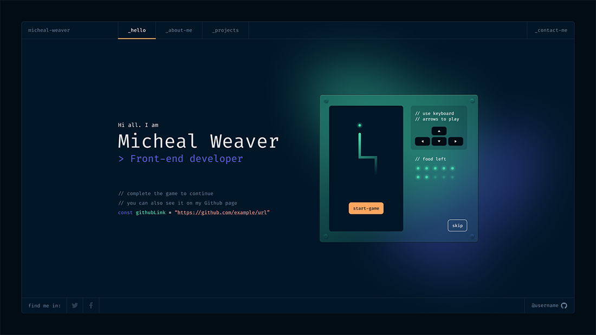

<h1 align="center">
  🚀 My Awesome Developer Portfolio
</h1>

  A sleek and modern portfolio showcasing my skills and projects as a developer.

  

  

## 🙏 Acknowledgments

- Original design by [@darelova](https://www.behance.net/darelova)
- Initial development by [@alexdeploy](https://github.com/alexdeploy)

---

  Made with ❤️ by Yash

